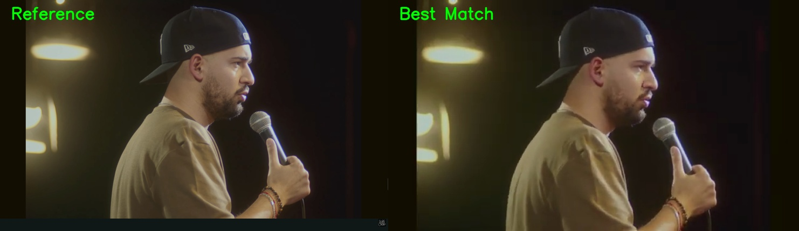
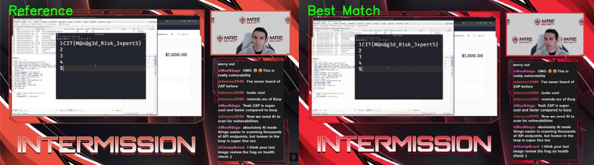

# FrameHunter

High-performance frame-to-video timestamp finder for CTF and forensic workflows. Supports local video files (MP4, AVI, etc.) and **direct YouTube/Online URLs**.

Given a reference image and a video (file or URL), FrameHunter finds the exact or closest timestamp where that frame appears.

## Features

- **Local & Online Support**: Accepts video files or direct links (YouTube, etc.).
- Coarse-to-fine search strategy for speed and precision.

- Keyframe-aware coarse scan (via `ffprobe`) when available.
- Hybrid similarity model:
	- SIFT feature matching + geometric validation (RANSAC)
	- **Normalized Template Matching** (for clean graphics and logos)
	- **Edge-based Shape Similarity** (robust to lighting/color shifts)
	- SSIM (structural similarity)
	- HSV histogram correlation (color distribution sanity check)
	- pHash perceptual similarity
- **Complexity/Entropy Filtering**: Automatically penalizes "flat" frames (e.g., white/black screens) to prevent false positives.

- Handles approximate matches (compression, minor noise, color shifts).
- Returns top-N matches with confidence and diagnostics.
- Optional side-by-side visualization output.
- Optional export of top-N matched frames to a directory.

## Architecture

- `framehunter/video_decoder.py`: video probing, frame access, keyframe timestamp extraction.
- `framehunter/similarity.py`: hybrid frame similarity scoring.
- `framehunter/search.py`: coarse -> refine search orchestration.
- `framehunter/cli.py`: CLI and JSON output.

## Installation

```bash
python3 -m venv .venv
source .venv/bin/activate
pip install -r requirements.txt
pip install -e .
```

Dependencies:

- Python 3.10+
- OpenCV (`opencv-python`)
- NumPy
- Optional but recommended: FFmpeg/ffprobe in PATH for keyframe scanning

## Usage

```bash
python -m framehunter --image frame.png --video video.mp4
```

or (after `pip install -e .`):

```bash
framehunter --image frame.png --video video.mp4
```

Top-N matches + tuned scanning:

```bash
python -m framehunter \
	--image frame.png \
	--video video.mp4 \
	--top-n 10 \
	--coarse-interval 1.5 \
	--refine-window 4.0
```

Disable keyframe assistance:

```bash
python -m framehunter --image frame.png --video video.mp4 --no-keyframes
```

Disable live progress output:

```bash
python -m framehunter --image frame.png --video video.mp4 --no-progress
```

Generate side-by-side match image:

```bash
python -m framehunter \
	--image frame.png \
	--video video.mp4 \
	--visualize match_preview.jpg
```

Export the top-N matched frames into a folder:

```bash
python -m framehunter \
	--image frame.png \
	--video video.mp4 \
	--top-n 5 \
	--export-top-frames-dir matched_frames
```

## Docker (Cross-Platform)

Run the tool the same way on macOS, Linux, or Windows (with Docker Desktop/Engine).

Build image:

```bash
docker build -t framehunter:latest .
```

Run with host folder mounted (inputs + outputs):

```bash
docker run --rm \
	-v "$(pwd)/testes:/data" \
	framehunter:latest \
	--image /data/frame.png \
	--video /data/video.mp4 \
	--top-n 5 \
	--export-top-frames-dir /data/top_matches \
	--visualize /data/match_preview.jpg
```

Windows PowerShell volume syntax example:

```powershell
docker run --rm `
	-v "${PWD}/testes:/data" `
	framehunter:latest `
	--image /data/frame.png `
	--video /data/video.mp4
```

Using Docker Compose:

```bash
docker compose build
docker compose run --rm framehunter --image /data/frame.png --video /data/video.mp4
```

Notes:

- Container includes FFmpeg (`ffprobe`) for keyframe-assisted coarse scan.
- Place files in `testes/` (default compose mount) or adjust the mount path.

## Output Format

FrameHunter prints JSON:

```json
{
	"timestamp_seconds": 123.456,
	"timestamp_human": "00:02:03.456",
	"confidence": 0.87,
	"method_used": "hybrid",
	"notes": "coarse-to-fine hybrid (SIFT-RANSAC + SSIM + HSV histogram + pHash)",
	"exported_top_frames": [
		"/data/top_matches/rank_01_00-14-17.399_0.7838.jpg"
	],
	"top_matches": [
		{
			"timestamp_seconds": 123.456,
			"timestamp_human": "00:02:03.456",
			"confidence": 0.91,
			"method_used": "hybrid",
			"diagnostics": {
				"stage": "fine",
				"sift": 0.84,
				"ssim": 0.89,
				"hist": 0.86,
				"phash": 0.85,
				"fps": 29.97
			}
		}
	]
}
```

## Result Examples

### Standard Validation


### Industrial Forensic Validation (Exhaustive Scan)


### Forensic Detection (Bright/Blurred Scenes)


Reference media attribution:

- Video source: João Pedro Pereira - Garoto | Stand-up Comedy
- Video source (Industrial): `このメドレーのこの部分が好きなのでここだけ作りました！合作＋ ADVANCED` (CTF Challenge)
- Video source (Forensic): `Live API Hacking: OpenVault Bank | AMA | Learning With A Hacker EP 2` (CIT CTF)


## Usage

### Fast Search
```bash
python -m framehunter --image frame.png --video video.mp4
```

### YouTube / Online Video Support
FrameHunter now supports direct URLs (YouTube, etc.). The video will be automatically downloaded and processed.
```bash
python -m framehunter --image image.png --video "https://www.youtube.com/watch?v=dQw4w9WgXcQ"
```

### Exhaustive Forensic Scan (Highest Accuracy)
Use this when precision is the only priority. This performs a dense 0.1s interval scan with pyramid matching.
```bash
python -m framehunter \
	--image frame.png \
	--video video.mp4 \
	--top-n 5 \
	--coarse-interval 0.1 \
	--refine-window 2.0 \
	--visualize match_result.jpg
```


---
Created with ❤️ for the CTF and Forensic community.

